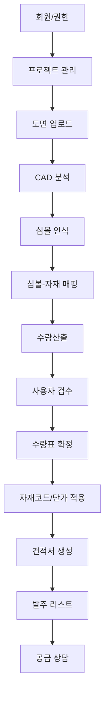

# 02_FRD.md
# 볼틱스 전기도면 기반 전기자재 수량산출·견적·공급 자동화 플랫폼 기능 요구사항 문서

- 문서명: Functional Requirements Document
- 프로젝트명: Voltix 전기자재 자동화 플랫폼
- 버전: v0.1
- 작성일: 2026-07-09
- 대상: 백엔드 개발자, 프론트엔드 개발자, QA, PM, 디자이너

---

## 1. 문서 목적

본 문서는 볼틱스 플랫폼의 기능 요구사항을 개발 가능한 수준으로 정의한다. 제품 요구사항 문서(PRD)의 방향성을 바탕으로 각 기능의 입력값, 처리 로직, 출력값, 예외 처리, 화면 요구사항, 수용 기준을 구체화한다.

---

## 2. 전체 기능 구조



---

## 3. 사용자 권한

| 권한 | 설명 | 주요 기능 |
|---|---|---|
| Admin | 시스템 관리자 | 사용자 관리, 자재코드, 단가표, 전체 프로젝트 관리 |
| Manager | 회사/팀 관리자 | 프로젝트 생성, 도면 등록, 견적 확정, 사용자 초대 |
| Estimator | 적산/공무 담당자 | 도면 분석, 수량 검수, 수량표 생성 |
| Viewer | 조회 사용자 | 프로젝트 및 결과 조회 |
| Supplier | 공급 담당자 | 견적 확인, 공급 상담, 발주 리스트 확인 |

---

## 4. 기능 목록

| 기능 ID | 기능명 | 설명 | 우선순위 |
|---|---|---|---|
| FR-001 | 회원가입 | 신규 사용자 등록 | P1 |
| FR-002 | 로그인/로그아웃 | 계정 인증 및 세션 관리 | P1 |
| FR-003 | 프로젝트 생성 | 현장 프로젝트 등록 | P1 |
| FR-004 | 프로젝트 목록 | 프로젝트 조회 및 검색 | P1 |
| FR-005 | 도면 업로드 | DWG/DXF/PDF 파일 등록 | P1 |
| FR-006 | 도면 파일 검증 | 확장자, 용량, 파일 무결성 확인 | P1 |
| FR-007 | CAD 정보 추출 | 블록, 레이어, 좌표, 속성 추출 | P1 |
| FR-008 | 도면 뷰어 | 웹 화면에서 도면 미리보기 | P1 |
| FR-009 | 심볼 목록 생성 | 추출된 심볼 목록 표시 | P1 |
| FR-010 | 심볼 자동 분류 | 심볼 유형 자동 분류 | P1 |
| FR-011 | 심볼-자재 매핑 | 심볼과 자재 품목 연결 | P1 |
| FR-012 | 매핑 규칙 저장 | 프로젝트별/공통 매핑 규칙 저장 | P1 |
| FR-013 | 수량 자동 산출 | 품목별 수량 계산 | P1 |
| FR-014 | 수량 검수 | 누락, 중복, 오분류 수정 | P1 |
| FR-015 | 수량 확정 | 검수 완료 후 결과 확정 | P1 |
| FR-016 | 엑셀 출력 | 수량표 다운로드 | P1 |
| FR-017 | 자재코드 관리 | 품명, 규격, 제조사, 품번 관리 | P2 |
| FR-018 | 단가표 관리 | 자재 단가 등록 및 적용 | P2 |
| FR-019 | 견적서 생성 | 수량 × 단가 기반 견적서 생성 | P2 |
| FR-020 | 발주 리스트 생성 | 공급 요청 품목 리스트 생성 | P2 |
| FR-021 | 공급 상담 요청 | 견적 결과 기반 상담 접수 | P2 |
| FR-022 | 도면 변경 비교 | 버전별 수량 차이 비교 | P3 |
| FR-023 | PDF 심볼 인식 | PDF 도면 기반 심볼 분석 | P3 |

---

## 5. 기능 상세

## FR-001. 회원가입

### 목적
사용자가 볼틱스 플랫폼을 이용하기 위해 계정을 생성한다.

### 입력값
| 필드 | 필수 | 설명 |
|---|---|---|
| email | Y | 로그인 이메일 |
| password | Y | 비밀번호 |
| name | Y | 사용자 이름 |
| company_name | N | 회사명 |
| role | N | 직무/권한 요청 |

### 처리 로직
1. 이메일 형식을 검증한다.
2. 중복 이메일 여부를 확인한다.
3. 비밀번호 보안 조건을 확인한다.
4. 사용자 계정을 생성한다.
5. 기본 권한은 Viewer 또는 Estimator로 설정한다.

### 출력값
- 회원가입 성공 메시지
- 사용자 ID
- 기본 권한

### 예외 처리
| 상황 | 처리 |
|---|---|
| 이메일 중복 | 중복 이메일 안내 |
| 비밀번호 조건 미달 | 보안 조건 안내 |
| 필수값 누락 | 누락 항목 표시 |

---

## FR-003. 프로젝트 생성

### 목적
현장 또는 견적 단위로 프로젝트를 생성한다.

### 입력값
| 필드 | 필수 | 설명 |
|---|---|---|
| project_name | Y | 프로젝트명 |
| client_name | N | 고객사명 |
| site_name | Y | 현장명 |
| building_type | Y | 공동주택, 오피스텔, 상가 등 |
| description | N | 프로젝트 설명 |
| unit_types | N | 세대 타입 정보 |

### 처리 로직
1. 프로젝트명을 확인한다.
2. 생성 사용자를 프로젝트 소유자로 등록한다.
3. 프로젝트 상태를 Draft로 설정한다.
4. 프로젝트 기본 폴더와 저장소 경로를 생성한다.

### 출력값
- project_id
- project_status
- created_at

### 예외 처리
| 상황 | 처리 |
|---|---|
| 프로젝트명 누락 | 입력 요청 |
| 권한 부족 | 생성 불가 메시지 |

---

## FR-005. 도면 업로드

### 목적
사용자가 프로젝트에 DWG, DXF, PDF 도면 파일을 업로드한다.

### 입력값
| 필드 | 필수 | 설명 |
|---|---|---|
| project_id | Y | 프로젝트 ID |
| drawing_file | Y | 도면 파일 |
| drawing_name | Y | 도면명 |
| drawing_version | N | 도면 버전 |
| floor_info | N | 층 정보 |
| unit_type | N | 세대 타입 |

### 처리 로직
1. 파일 확장자를 검증한다.
2. 파일 용량 제한을 확인한다.
3. 파일을 저장소에 업로드한다.
4. 도면 메타데이터를 DB에 저장한다.
5. 도면 분석 작업을 대기열에 등록한다.

### 출력값
- drawing_id
- upload_status
- analysis_job_id

### 예외 처리
| 상황 | 처리 |
|---|---|
| 허용되지 않은 파일 형식 | 업로드 차단 |
| 파일 용량 초과 | 업로드 차단 |
| 업로드 실패 | 재시도 안내 |

---

## FR-007. CAD 정보 추출

### 목적
DWG/DXF 도면에서 블록, 레이어, 좌표, 속성 정보를 추출한다.

### 입력값
| 필드 | 설명 |
|---|---|
| drawing_id | 분석 대상 도면 ID |
| file_path | 도면 파일 경로 |

### 처리 로직
1. CAD Parser가 도면 파일을 읽는다.
2. 블록 목록을 추출한다.
3. 레이어 목록을 추출한다.
4. 각 블록의 좌표, 회전값, 스케일, 속성을 추출한다.
5. 추출된 객체를 Symbol 테이블에 저장한다.
6. 분석 완료 상태를 저장한다.

### 출력값
| 출력 | 설명 |
|---|---|
| block_count | 추출 블록 수 |
| layer_count | 추출 레이어 수 |
| symbol_candidates | 심볼 후보 목록 |
| analysis_status | 분석 상태 |

### 예외 처리
| 상황 | 처리 |
|---|---|
| CAD 파일 파싱 실패 | 분석 실패 상태 저장 |
| 암호화/손상 파일 | 사용자에게 재업로드 요청 |
| 블록 없음 | 레이어/텍스트 기반 분석 후보 생성 |

---

## FR-010. 심볼 자동 분류

### 목적
추출된 CAD 객체를 스위치, 콘센트, 통신, 통합수구, 세대분전반 등으로 자동 분류한다.

### 입력값
| 필드 | 설명 |
|---|---|
| block_name | CAD 블록명 |
| layer_name | CAD 레이어명 |
| attributes | CAD 속성 |
| position | 좌표 |
| mapping_rules | 기존 매핑 규칙 |

### 처리 로직
1. 기존 매핑 규칙과 블록명을 비교한다.
2. 레이어명 키워드를 분석한다.
3. 블록 속성값을 확인한다.
4. 규칙 기반으로 symbol_type을 추정한다.
5. 신뢰도 점수를 계산한다.
6. 분류 결과를 저장한다.

### 출력값
| 필드 | 설명 |
|---|---|
| symbol_id | 심볼 ID |
| predicted_type | 예측 심볼 유형 |
| confidence_score | 인식 신뢰도 |
| classification_status | 자동/미분류/검수필요 |

### 예외 처리
| 상황 | 처리 |
|---|---|
| 매핑 규칙 없음 | 미분류 상태 처리 |
| 신뢰도 낮음 | 검수필요 상태 처리 |
| 복수 후보 존재 | 사용자 선택 요청 |

---

## FR-011. 심볼-자재 매핑

### 목적
도면 내 심볼을 실제 전기자재 품목과 연결한다.

### 입력값
| 필드 | 필수 | 설명 |
|---|---|---|
| symbol_type | Y | 심볼 유형 |
| block_name | Y | CAD 블록명 |
| material_id | Y | 자재 ID |
| rule_scope | Y | 프로젝트/회사/전체 |

### 처리 로직
1. 사용자가 심볼 후보를 선택한다.
2. 자재 목록에서 품목을 선택한다.
3. 매핑 규칙을 저장한다.
4. 동일 조건의 심볼에 매핑을 일괄 적용한다.
5. 수량산출 결과를 재계산한다.

### 출력값
- mapping_id
- mapped_symbol_count
- updated_quantity

### 예외 처리
| 상황 | 처리 |
|---|---|
| 자재 미등록 | 신규 자재 등록 유도 |
| 이미 매핑된 심볼 | 덮어쓰기 확인 |
| 권한 부족 | 저장 차단 |

---

## FR-013. 수량 자동 산출

### 목적
매핑된 심볼을 기준으로 품목별 수량을 자동 산출한다.

### 입력값
| 필드 | 설명 |
|---|---|
| drawing_id | 도면 ID |
| project_id | 프로젝트 ID |
| symbol_material_mappings | 심볼-자재 매핑 목록 |
| filters | 층, 구역, 세대 타입 필터 |

### 처리 로직
1. 도면 내 매핑 완료된 심볼을 조회한다.
2. 자재별로 심볼 수를 집계한다.
3. 도면, 층, 구역, 세대 타입 기준으로 그룹화한다.
4. 산출 결과를 QuantityResult에 저장한다.
5. 미분류 심볼은 별도 목록으로 표시한다.

### 출력값
| 출력 | 설명 |
|---|---|
| quantity_results | 품목별 수량 목록 |
| unmapped_symbols | 미매핑 심볼 목록 |
| total_quantity | 전체 수량 |

### 산출 기준
```text
자재별 수량 = 해당 자재로 매핑된 심볼 개수
프로젝트 총 수량 = 세대 타입별 수량 × 세대 타입별 적용 세대 수
견적 수량 = 검수 후 확정 수량
```

### 예외 처리
| 상황 | 처리 |
|---|---|
| 미매핑 심볼 존재 | 검수 화면에서 경고 표시 |
| 수량 0 | 결과표에 표시하되 견적 제외 가능 |
| 중복 좌표 의심 | 검수필요 상태 표시 |

---

## FR-014. 수량 검수

### 목적
사용자가 자동 산출 결과를 도면 위에서 확인하고 수정한다.

### 주요 기능
1. 도면 위 심볼 하이라이트 표시
2. 품목별 색상 또는 라벨 표시
3. 심볼 클릭 시 자재 정보 표시
4. 누락 심볼 수동 추가
5. 오인식 심볼 제외
6. 자재 품목 재매핑
7. 검수 완료 처리

### 입력값
| 필드 | 설명 |
|---|---|
| symbol_id | 수정 대상 심볼 ID |
| action | add, update, delete, exclude |
| material_id | 변경 자재 ID |
| note | 수정 사유 |

### 출력값
- updated_quantity
- verification_status
- audit_log

### 예외 처리
| 상황 | 처리 |
|---|---|
| 확정된 수량 수정 | 재검수 상태로 변경 |
| 권한 부족 | 수정 차단 |
| 동시 수정 충돌 | 최신 버전 기준 재조회 |

---

## FR-016. 엑셀 출력

### 목적
확정된 수량산출 결과를 엑셀 파일로 다운로드한다.

### 출력 항목
| 컬럼 | 설명 |
|---|---|
| 프로젝트명 | 프로젝트명 |
| 도면명 | 도면명 |
| 세대 타입 | 59A, 84A 등 |
| 층/구역 | 층 또는 구역 정보 |
| 자재 분류 | 스위치, 콘센트 등 |
| 품명 | 자재명 |
| 규격 | 자재 규격 |
| 품번 | 제조사 품번 |
| 단위 | EA, SET 등 |
| 수량 | 확정 수량 |
| 비고 | 검수 메모 |

### 처리 로직
1. 확정된 QuantityResult를 조회한다.
2. 자재 정보와 조인한다.
3. 엑셀 템플릿에 데이터를 입력한다.
4. 다운로드 파일을 생성한다.

### 예외 처리
| 상황 | 처리 |
|---|---|
| 확정 수량 없음 | 다운로드 불가 안내 |
| 파일 생성 실패 | 재시도 안내 |

---

## FR-017. 자재코드 관리

### 목적
자재명, 규격, 제조사, 품번, 단위 등을 관리한다.

### 입력값
| 필드 | 필수 | 설명 |
|---|---|---|
| category | Y | 자재 분류 |
| material_name | Y | 품명 |
| specification | N | 규격 |
| brand | N | 제조사 |
| model_code | N | 품번 |
| unit | Y | 단위 |
| description | N | 설명 |

### 기능
- 자재 등록
- 자재 수정
- 자재 삭제 또는 비활성화
- 자재 검색
- 엑셀 일괄 업로드

---

## FR-018. 단가표 관리

### 목적
자재별 단가를 등록하고 견적서에 적용한다.

### 입력값
| 필드 | 설명 |
|---|---|
| material_id | 자재 ID |
| price_type | 기준가, 공급가, 프로젝트가 |
| unit_price | 단가 |
| currency | 통화 |
| valid_from | 적용 시작일 |
| valid_to | 적용 종료일 |

### 처리 로직
1. 자재별 단가를 등록한다.
2. 프로젝트별 단가 적용 여부를 확인한다.
3. 견적 생성 시 유효한 단가를 적용한다.
4. 단가 이력을 보존한다.

---

## FR-019. 견적서 생성

### 목적
확정 수량과 단가를 기반으로 견적서를 생성한다.

### 입력값
| 필드 | 설명 |
|---|---|
| project_id | 프로젝트 ID |
| quantity_result_ids | 확정 수량 ID 목록 |
| price_policy | 단가 적용 기준 |
| discount_rate | 할인율 |
| tax_option | 부가세 포함 여부 |

### 처리 로직
1. 확정 수량을 조회한다.
2. 자재별 단가를 적용한다.
3. 금액을 계산한다.
4. 할인 및 부가세 정책을 적용한다.
5. 견적서를 생성한다.

### 계산식
```text
품목 금액 = 확정 수량 × 적용 단가
공급가 합계 = 품목 금액 합계
부가세 = 공급가 합계 × 10%
총 견적 금액 = 공급가 합계 + 부가세 - 할인 금액
```

### 출력값
- estimate_id
- estimate_items
- total_amount
- excel_quote_file

---

## FR-020. 발주 리스트 생성

### 목적
견적 결과를 바탕으로 발주용 품목 리스트를 생성한다.

### 출력 항목
| 컬럼 | 설명 |
|---|---|
| 자재 분류 | 품목 분류 |
| 품명 | 자재명 |
| 규격 | 규격 |
| 제조사 | 브랜드 |
| 품번 | 모델 코드 |
| 수량 | 발주 수량 |
| 단위 | EA, SET 등 |
| 납기 요청일 | 요청 납기 |
| 비고 | 현장 메모 |

---

## 6. 상태 정의

### 6.1 프로젝트 상태

| 상태 | 설명 |
|---|---|
| Draft | 프로젝트 생성 후 도면 미등록 |
| Uploaded | 도면 업로드 완료 |
| Analyzing | 도면 분석 중 |
| AnalysisFailed | 도면 분석 실패 |
| ReadyForMapping | 심볼 매핑 대기 |
| Counting | 수량산출 중 |
| ReviewRequired | 검수 필요 |
| Verified | 검수 완료 |
| Estimated | 견적 생성 완료 |
| Ordered | 발주 리스트 생성 완료 |

### 6.2 심볼 상태

| 상태 | 설명 |
|---|---|
| Detected | CAD 분석으로 감지됨 |
| Classified | 자동 분류됨 |
| Unmapped | 자재 매핑 필요 |
| Mapped | 자재 매핑 완료 |
| ReviewRequired | 사용자 검수 필요 |
| Verified | 검수 완료 |
| Excluded | 산출 제외 |

---

## 7. 화면 요구사항

## 7.1 대시보드

### 표시 항목
- 전체 프로젝트 수
- 분석 대기 도면 수
- 검수 필요 프로젝트 수
- 최근 프로젝트 목록
- 견적 진행 상태

### 주요 액션
- 프로젝트 생성
- 프로젝트 열기
- 최근 도면 분석 결과 확인

---

## 7.2 도면 분석 화면

### 구성
- 좌측: 도면 뷰어
- 우측: 심볼 목록, 레이어 목록, 매핑 상태
- 하단: 자동 카운팅 결과 요약

### 기능
- 확대/축소
- 심볼 선택
- 품목별 필터
- 미매핑 심볼 필터
- 검수필요 심볼 필터

---

## 7.3 수량표 화면

### 구성
- 품목별 수량표
- 세대 타입별 수량표
- 층/구역별 수량표
- 미매핑/검수필요 항목 표시

### 기능
- 필터링
- 정렬
- 엑셀 다운로드
- 견적서 생성으로 이동

---

## 8. API 요구사항 초안

| Method | Endpoint | 설명 |
|---|---|---|
| POST | /auth/signup | 회원가입 |
| POST | /auth/login | 로그인 |
| GET | /projects | 프로젝트 목록 |
| POST | /projects | 프로젝트 생성 |
| GET | /projects/{id} | 프로젝트 상세 |
| POST | /projects/{id}/drawings | 도면 업로드 |
| GET | /drawings/{id} | 도면 상세 |
| POST | /drawings/{id}/analyze | 도면 분석 실행 |
| GET | /drawings/{id}/symbols | 심볼 목록 조회 |
| POST | /symbols/{id}/map | 심볼 자재 매핑 |
| POST | /drawings/{id}/count | 수량산출 실행 |
| GET | /projects/{id}/quantities | 수량표 조회 |
| PATCH | /quantities/{id} | 검수 수량 수정 |
| POST | /projects/{id}/export/excel | 엑셀 출력 |
| GET | /materials | 자재 목록 |
| POST | /materials | 자재 등록 |
| POST | /prices | 단가 등록 |
| POST | /projects/{id}/estimates | 견적서 생성 |
| POST | /estimates/{id}/orders | 발주 리스트 생성 |

---

## 9. 비기능 요구사항

| 항목 | 요구사항 |
|---|---|
| 성능 | 50MB 이하 DWG 파일 분석은 5분 이내 처리 목표 |
| 보안 | 프로젝트 파일은 사용자/조직 권한에 따라 접근 제한 |
| 파일 보관 | 업로드 원본과 분석 결과를 분리 보관 |
| 감사 로그 | 수량 수정, 견적 수정, 단가 수정 이력 저장 |
| 확장성 | PDF 인식, AI 학습, ERP 연동 가능 구조 |
| 백업 | 도면 파일과 DB 정기 백업 |
| 오류 추적 | 분석 실패 원인 로그 저장 |

---

## 10. QA 테스트 시나리오

| 테스트 ID | 시나리오 | 기대 결과 |
|---|---|---|
| QA-001 | 정상 DWG 파일 업로드 | 업로드 성공 및 분석 대기 상태 |
| QA-002 | 허용되지 않은 파일 업로드 | 업로드 차단 |
| QA-003 | 블록 포함 DWG 분석 | 블록 목록과 좌표 추출 |
| QA-004 | 심볼 매핑 후 수량산출 | 품목별 수량 생성 |
| QA-005 | 미매핑 심볼 존재 | 미매핑 목록 표시 |
| QA-006 | 검수 화면에서 심볼 제외 | 수량 재계산 |
| QA-007 | 수량표 엑셀 다운로드 | 정상 파일 생성 |
| QA-008 | 단가 적용 견적 생성 | 금액 계산 정상 |
| QA-009 | 권한 없는 사용자 수정 | 접근 차단 |
| QA-010 | 분석 실패 파일 업로드 | 실패 상태 및 재업로드 안내 |

---

## 11. 개발 우선순위

### Sprint 1
- 회원/권한
- 프로젝트 생성
- 도면 업로드
- 도면 메타데이터 저장

### Sprint 2
- CAD Parser 연동
- 블록/레이어 추출
- 심볼 목록 화면

### Sprint 3
- 심볼 자동 분류
- 심볼-자재 매핑
- 수량 자동 산출

### Sprint 4
- 도면 뷰어
- 사용자 검수
- 수량표 확정

### Sprint 5
- 자재코드 관리
- 단가표 관리
- 엑셀 출력

### Sprint 6
- 견적서 생성
- 발주 리스트
- PoC 테스트

---

## 12. 완료 기준

1. DWG 파일 업로드와 분석이 가능하다.
2. CAD 블록·레이어·좌표 정보가 추출된다.
3. 심볼과 자재 품목을 매핑할 수 있다.
4. 주요 품목의 수량이 자동 산출된다.
5. 사용자가 자동 산출 결과를 검수할 수 있다.
6. 검수 완료 수량표를 엑셀로 출력할 수 있다.
7. 자재코드와 단가를 적용해 견적서를 생성할 수 있다.
8. 발주 리스트를 생성할 수 있다.
9. 분석 실패, 미매핑, 권한 부족 등 주요 예외가 처리된다.
