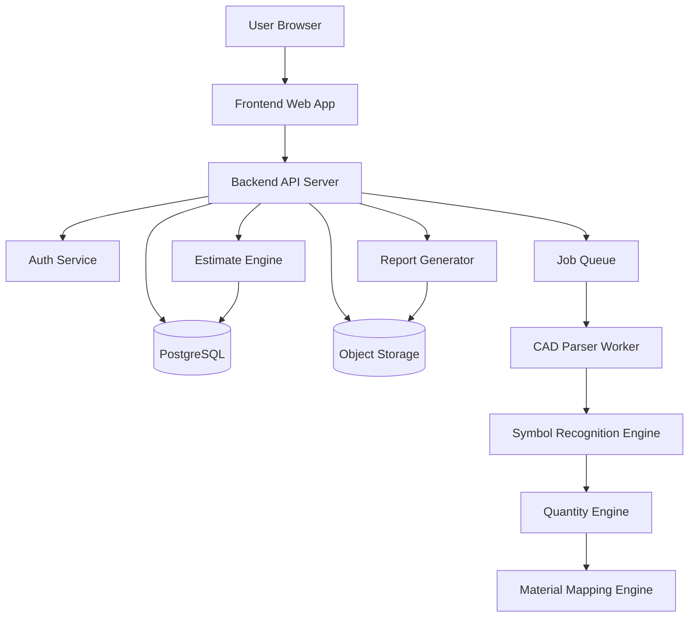
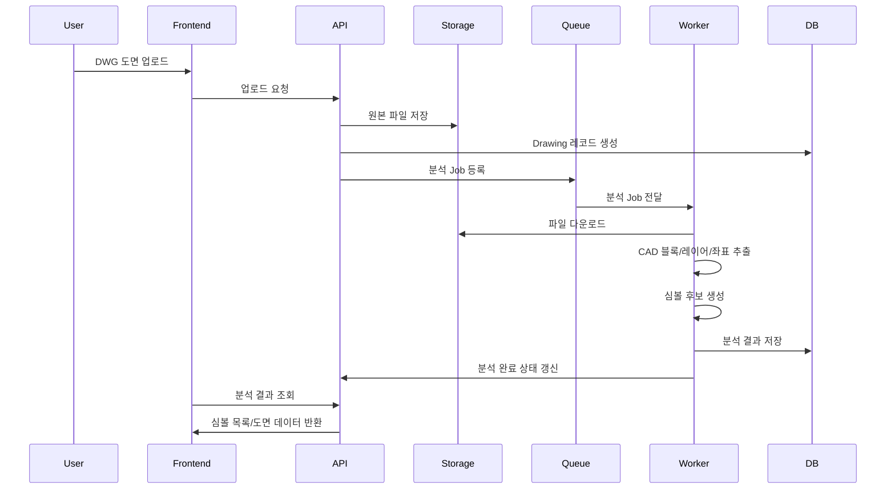
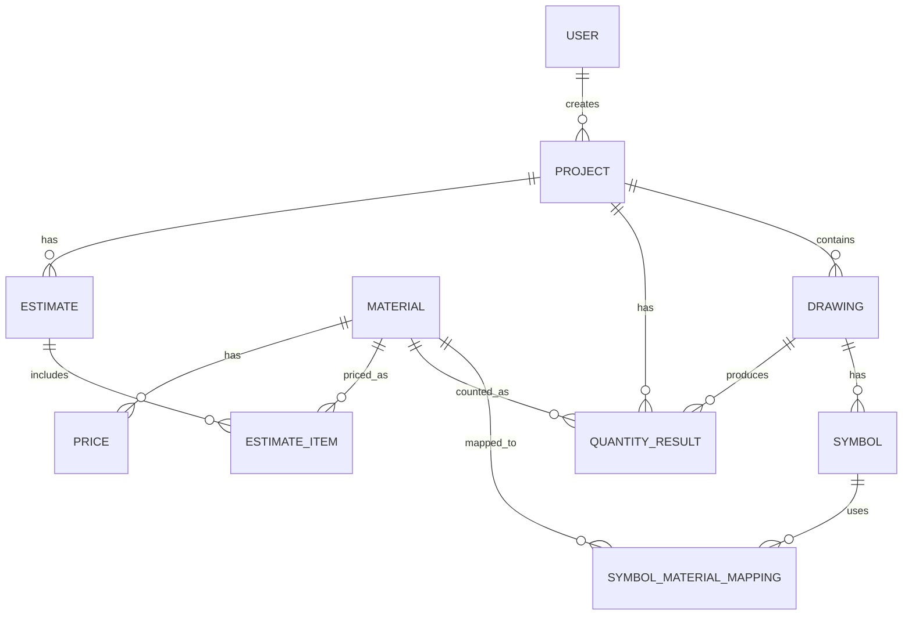
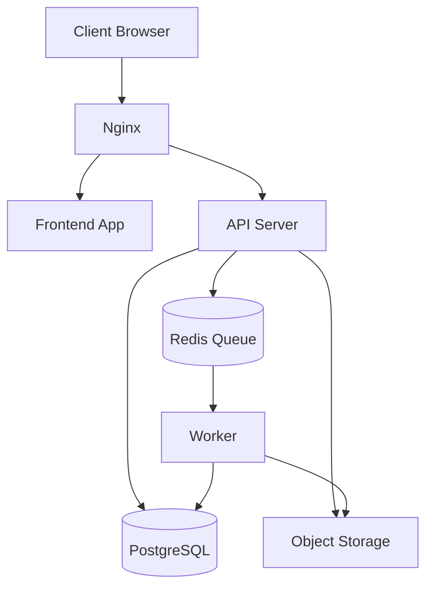

# 03_TRD.md
# 볼틱스 전기도면 기반 전기자재 수량산출·견적·공급 자동화 플랫폼 기술 요구사항 문서

- 문서명: Technical Requirements Document
- 프로젝트명: Voltix 전기자재 자동화 플랫폼
- 버전: v0.1
- 작성일: 2026-07-09
- 대상: 개발 리드, 백엔드 개발자, 프론트엔드 개발자, 인프라/DevOps, 데이터/AI 엔지니어

---

## 1. 문서 목적

본 문서는 볼틱스 플랫폼의 기술 설계 방향을 정의한다. 전기도면 업로드, CAD 분석, 심볼 인식, 수량산출, 자재 매핑, 견적 생성, 엑셀 출력, 공급 상담 연결을 구현하기 위한 시스템 아키텍처, 데이터 모델, API 구조, 처리 파이프라인, 보안 및 확장 요구사항을 포함한다.

---

## 2. 시스템 개요

볼틱스는 웹 기반 SaaS 형태를 지향한다. 사용자는 웹 브라우저에서 프로젝트를 생성하고 도면 파일을 업로드한다. 백엔드는 도면 파일을 저장한 뒤 CAD 분석 작업을 비동기 처리한다. 분석 결과는 DB에 저장되며, 사용자는 도면 뷰어에서 심볼 인식 결과를 검수하고 수량표, 견적서, 발주 리스트를 생성한다.

---

## 3. 전체 아키텍처



---

## 4. 기술 스택 제안

| 영역 | 권장 기술 | 비고 |
|---|---|---|
| Frontend | React / Next.js | 도면 뷰어와 업무 화면 구성 |
| Backend | Node.js NestJS 또는 Python FastAPI | API 서버 |
| Database | PostgreSQL | 프로젝트, 심볼, 자재, 견적 데이터 |
| File Storage | S3 호환 Object Storage | DWG/PDF/엑셀 파일 저장 |
| Queue | Redis Queue / Celery / BullMQ | 도면 분석 비동기 처리 |
| CAD Parser | ODA File Converter, ezdxf, LibreDWG 검토 | DWG/DXF 분석 방식 검토 필요 |
| Drawing Viewer | SVG/Canvas/WebGL 기반 뷰어 | 웹 도면 표시 |
| Report | ExcelJS / openpyxl | 엑셀 출력 |
| Auth | JWT + Refresh Token | 사용자 인증 |
| Infra | Docker, Nginx, Linux Server | MVP 기준 |
| Monitoring | Sentry, Prometheus, Grafana | 오류 및 성능 모니터링 |

> DWG 파싱은 라이선스와 포맷 호환성이 중요하므로, 실제 개발 전 상용/오픈소스 라이브러리 검토가 필요하다. MVP에서는 DXF 변환 후 분석하는 방식도 검토할 수 있다.

---

## 5. 핵심 모듈

| 모듈 | 역할 |
|---|---|
| Frontend App | 프로젝트 관리, 도면 업로드, 도면 검수 UI, 수량표, 견적서 화면 |
| API Server | 인증, 프로젝트, 도면, 자재, 견적, 보고서 API 제공 |
| CAD Parser Worker | DWG/DXF 파일에서 블록, 레이어, 좌표, 속성 추출 |
| Symbol Recognition Engine | 추출 객체를 전기 심볼 유형으로 분류 |
| Mapping Engine | 심볼과 자재 품목 매핑 규칙 적용 |
| Quantity Engine | 자재별·도면별·세대별·층별 수량 집계 |
| Estimate Engine | 단가 적용 및 견적 금액 계산 |
| Report Generator | 엑셀 수량표, 견적서, 발주 리스트 생성 |
| Admin Module | 자재코드, 단가표, 권한, 매핑 규칙 관리 |

---

## 6. 도면 분석 파이프라인



---

## 7. CAD 분석 전략

### 7.1 1차 전략: DWG/DXF 블록 기반 분석

초기 MVP에서는 AI 이미지 인식보다 CAD 객체 정보를 활용한다.

분석 대상:
- Block name
- Layer name
- Insert point 좌표
- Rotation
- Scale
- Attribute values
- Text annotations
- Drawing unit

### 7.2 DXF 변환 전략

DWG 직접 파싱이 어려울 경우 다음 방식을 검토한다.

1. 업로드된 DWG를 서버에서 DXF로 변환한다.
2. DXF 파일을 파싱한다.
3. BLOCK, INSERT, LAYER 정보를 추출한다.
4. 추출 결과를 표준 Symbol 객체로 변환한다.

### 7.3 PDF 분석은 후순위

PDF 도면은 CAD 블록 정보가 손실될 가능성이 높다. 따라서 MVP에서는 DWG/DXF 기반 분석을 우선한다.

PDF 분석 단계:
1. 벡터 PDF 객체 추출
2. 심볼 패턴 분석
3. 이미지 PDF OCR/컴퓨터 비전 적용
4. 사용자 검수 기반 학습

---

## 8. 심볼 인식 로직

### 8.1 규칙 기반 분류

초기 심볼 인식은 다음 우선순위로 판단한다.

1. 저장된 매핑 규칙과 block_name 일치 여부
2. layer_name 키워드 분석
3. block_name 키워드 분석
4. attributes 내 품목명/기호 분석
5. 사용자 정의 매핑 규칙 적용
6. 미분류 상태 처리

### 8.2 예시 규칙

| 조건 | 분류 결과 |
|---|---|
| block_name contains `SW` | 스위치 |
| block_name contains `CON` | 콘센트 |
| block_name contains `LAN` | 통신 인출구 |
| block_name contains `TV` | TV 수구 |
| block_name contains `TEL` | 전화 수구 |
| block_name contains `PANEL` | 세대분전반 |
| layer_name contains `전등` | 전등 관련 심볼 |
| layer_name contains `통신` | 통신 관련 심볼 |

### 8.3 신뢰도 점수

```text
confidence_score = rule_match_score + layer_match_score + attribute_match_score + user_mapping_score
```

| 점수 구간 | 상태 |
|---|---|
| 0.85 이상 | 자동 분류 |
| 0.60 ~ 0.84 | 검수 필요 |
| 0.60 미만 | 미분류 |

---

## 9. 수량산출 로직

### 9.1 기본 산출

```text
자재별 수량 = 해당 material_id로 매핑된 symbol 개수
도면별 수량 = drawing_id 기준 자재별 수량 합계
세대 타입별 수량 = unit_type 기준 자재별 수량 합계
프로젝트 총 수량 = 세대 타입별 수량 × 세대 타입별 세대 수
견적 수량 = 검수 후 확정 수량
```

### 9.2 중복 심볼 감지

중복 의심 조건:
- 동일 material_id
- 동일 또는 근접 좌표
- 동일 block_name
- 좌표 거리 기준값 이하

```text
distance = sqrt((x1-x2)^2 + (y1-y2)^2)
if distance < threshold and material_id same:
    mark as duplicate_candidate
```

### 9.3 미분류 심볼 처리

미분류 심볼은 수량표에 반영하지 않고 검수 화면에서 별도 표시한다. 사용자가 매핑하면 수량산출을 재실행한다.

---

## 10. 데이터 모델

## 10.1 ERD



---

## 10.2 users

| 컬럼 | 타입 | 설명 |
|---|---|---|
| id | uuid | 사용자 ID |
| email | varchar | 이메일 |
| password_hash | varchar | 비밀번호 해시 |
| name | varchar | 이름 |
| company_name | varchar | 회사명 |
| role | varchar | 권한 |
| created_at | timestamp | 생성일 |
| updated_at | timestamp | 수정일 |

---

## 10.3 projects

| 컬럼 | 타입 | 설명 |
|---|---|---|
| id | uuid | 프로젝트 ID |
| project_name | varchar | 프로젝트명 |
| client_name | varchar | 고객사명 |
| site_name | varchar | 현장명 |
| building_type | varchar | 건물 유형 |
| status | varchar | 프로젝트 상태 |
| created_by | uuid | 생성 사용자 |
| created_at | timestamp | 생성일 |
| updated_at | timestamp | 수정일 |

---

## 10.4 drawings

| 컬럼 | 타입 | 설명 |
|---|---|---|
| id | uuid | 도면 ID |
| project_id | uuid | 프로젝트 ID |
| drawing_name | varchar | 도면명 |
| file_type | varchar | DWG/DXF/PDF |
| file_path | varchar | 원본 파일 경로 |
| converted_file_path | varchar | 변환 파일 경로 |
| drawing_version | varchar | 도면 버전 |
| floor_info | varchar | 층 정보 |
| unit_type | varchar | 세대 타입 |
| analysis_status | varchar | 분석 상태 |
| uploaded_at | timestamp | 업로드일 |

---

## 10.5 symbols

| 컬럼 | 타입 | 설명 |
|---|---|---|
| id | uuid | 심볼 ID |
| drawing_id | uuid | 도면 ID |
| block_name | varchar | CAD 블록명 |
| layer_name | varchar | 레이어명 |
| symbol_type | varchar | 심볼 유형 |
| position_x | numeric | X 좌표 |
| position_y | numeric | Y 좌표 |
| rotation | numeric | 회전값 |
| scale_x | numeric | X 스케일 |
| scale_y | numeric | Y 스케일 |
| attributes | jsonb | CAD 속성 |
| confidence_score | numeric | 인식 신뢰도 |
| status | varchar | 심볼 상태 |
| created_at | timestamp | 생성일 |

---

## 10.6 materials

| 컬럼 | 타입 | 설명 |
|---|---|---|
| id | uuid | 자재 ID |
| category | varchar | 자재 분류 |
| material_name | varchar | 품명 |
| specification | varchar | 규격 |
| brand | varchar | 제조사 |
| model_code | varchar | 품번 |
| unit | varchar | 단위 |
| description | text | 설명 |
| is_active | boolean | 사용 여부 |
| created_at | timestamp | 생성일 |

---

## 10.7 symbol_material_mappings

| 컬럼 | 타입 | 설명 |
|---|---|---|
| id | uuid | 매핑 ID |
| project_id | uuid | 프로젝트 ID, 공통 규칙이면 null 가능 |
| block_name | varchar | 블록명 |
| layer_name | varchar | 레이어명 |
| symbol_type | varchar | 심볼 유형 |
| material_id | uuid | 자재 ID |
| rule_scope | varchar | project/company/global |
| created_by | uuid | 생성 사용자 |
| created_at | timestamp | 생성일 |

---

## 10.8 quantity_results

| 컬럼 | 타입 | 설명 |
|---|---|---|
| id | uuid | 수량 결과 ID |
| project_id | uuid | 프로젝트 ID |
| drawing_id | uuid | 도면 ID |
| material_id | uuid | 자재 ID |
| unit_type | varchar | 세대 타입 |
| floor_info | varchar | 층 정보 |
| auto_quantity | numeric | 자동 산출 수량 |
| verified_quantity | numeric | 검수 후 수량 |
| status | varchar | draft/reviewed/confirmed |
| created_at | timestamp | 생성일 |
| updated_at | timestamp | 수정일 |

---

## 10.9 prices

| 컬럼 | 타입 | 설명 |
|---|---|---|
| id | uuid | 단가 ID |
| material_id | uuid | 자재 ID |
| price_type | varchar | 기준가/공급가/프로젝트가 |
| unit_price | numeric | 단가 |
| currency | varchar | 통화 |
| valid_from | date | 적용 시작일 |
| valid_to | date | 적용 종료일 |
| created_at | timestamp | 생성일 |

---

## 10.10 estimates / estimate_items

### estimates

| 컬럼 | 타입 | 설명 |
|---|---|---|
| id | uuid | 견적 ID |
| project_id | uuid | 프로젝트 ID |
| estimate_name | varchar | 견적명 |
| status | varchar | draft/confirmed/sent |
| supply_amount | numeric | 공급가 |
| vat_amount | numeric | 부가세 |
| total_amount | numeric | 총액 |
| created_at | timestamp | 생성일 |

### estimate_items

| 컬럼 | 타입 | 설명 |
|---|---|---|
| id | uuid | 견적 품목 ID |
| estimate_id | uuid | 견적 ID |
| material_id | uuid | 자재 ID |
| quantity | numeric | 수량 |
| unit_price | numeric | 단가 |
| amount | numeric | 금액 |
| note | text | 비고 |

---

## 11. API 설계 초안

## 11.1 인증

```http
POST /api/auth/signup
POST /api/auth/login
POST /api/auth/logout
POST /api/auth/refresh
```

## 11.2 프로젝트

```http
GET    /api/projects
POST   /api/projects
GET    /api/projects/{projectId}
PATCH  /api/projects/{projectId}
DELETE /api/projects/{projectId}
```

## 11.3 도면

```http
POST   /api/projects/{projectId}/drawings
GET    /api/drawings/{drawingId}
POST   /api/drawings/{drawingId}/analyze
GET    /api/drawings/{drawingId}/analysis-status
GET    /api/drawings/{drawingId}/symbols
```

## 11.4 심볼/매핑

```http
GET    /api/drawings/{drawingId}/symbols
PATCH  /api/symbols/{symbolId}
POST   /api/symbols/{symbolId}/map
POST   /api/mapping-rules
GET    /api/projects/{projectId}/mapping-rules
```

## 11.5 수량

```http
POST   /api/drawings/{drawingId}/count
GET    /api/projects/{projectId}/quantities
PATCH  /api/quantities/{quantityId}
POST   /api/projects/{projectId}/quantities/confirm
```

## 11.6 자재/단가

```http
GET    /api/materials
POST   /api/materials
PATCH  /api/materials/{materialId}
DELETE /api/materials/{materialId}
POST   /api/materials/import
GET    /api/prices
POST   /api/prices
```

## 11.7 견적/발주/출력

```http
POST   /api/projects/{projectId}/estimates
GET    /api/estimates/{estimateId}
PATCH  /api/estimates/{estimateId}
POST   /api/estimates/{estimateId}/export
POST   /api/estimates/{estimateId}/orders
POST   /api/projects/{projectId}/export/quantity-excel
```

---

## 12. 비동기 작업 설계

### 12.1 Job 종류

| Job | 설명 |
|---|---|
| drawing_parse_job | CAD 파일 파싱 |
| symbol_classification_job | 심볼 자동 분류 |
| quantity_count_job | 수량 자동 산출 |
| report_generate_job | 엑셀/보고서 생성 |
| pdf_convert_job | PDF 또는 이미지 변환 |

### 12.2 Job 상태

| 상태 | 설명 |
|---|---|
| queued | 대기 중 |
| processing | 처리 중 |
| completed | 완료 |
| failed | 실패 |
| retrying | 재시도 중 |

### 12.3 재시도 정책

- CAD 파싱 실패: 최대 2회 재시도
- 파일 변환 실패: 최대 1회 재시도
- 엑셀 생성 실패: 최대 2회 재시도
- 파싱 불가 파일은 failed 상태로 저장하고 사용자에게 재업로드 안내

---

## 13. 파일 저장 구조

```text
/storage
  /projects
    /{project_id}
      /drawings
        /original
          drawing_v1.dwg
        /converted
          drawing_v1.dxf
          drawing_v1.svg
        /reports
          quantity_report.xlsx
          estimate.xlsx
```

파일 메타데이터는 DB에 저장하고, 실제 파일은 Object Storage에 저장한다.

---

## 14. 도면 뷰어 설계

### 14.1 요구사항

- 확대/축소
- 이동
- 심볼 클릭
- 품목별 필터
- 미매핑 심볼 표시
- 검수필요 심볼 표시
- 심볼 추가/제외/수정

### 14.2 구현 방식

1. CAD 분석 결과를 좌표 데이터로 변환한다.
2. 도면 배경은 SVG 또는 Canvas로 렌더링한다.
3. 심볼 좌표를 오버레이 레이어로 표시한다.
4. 사용자가 심볼을 클릭하면 속성 패널을 표시한다.

---

## 15. 보안 요구사항

| 항목 | 요구사항 |
|---|---|
| 인증 | JWT Access Token + Refresh Token |
| 비밀번호 | bcrypt 또는 argon2 해시 |
| 권한 | 프로젝트 단위 RBAC 적용 |
| 파일 접근 | 서명 URL 또는 서버 프록시 다운로드 |
| 로그 | 수량 수정, 단가 수정, 견적 확정 이력 저장 |
| 데이터 분리 | 조직/회사 단위 데이터 접근 제한 |
| 백업 | DB와 파일 저장소 정기 백업 |

---

## 16. 감사 로그

수정 이력이 필요한 이벤트:

- 도면 업로드
- 도면 삭제
- 심볼 매핑 변경
- 수량 수정
- 수량 확정
- 자재코드 수정
- 단가 변경
- 견적서 생성
- 견적서 확정
- 발주 리스트 생성

### audit_logs 테이블

| 컬럼 | 타입 | 설명 |
|---|---|---|
| id | uuid | 로그 ID |
| user_id | uuid | 사용자 ID |
| entity_type | varchar | 대상 유형 |
| entity_id | uuid | 대상 ID |
| action | varchar | 작업 |
| before_data | jsonb | 변경 전 |
| after_data | jsonb | 변경 후 |
| created_at | timestamp | 생성일 |

---

## 17. 성능 요구사항

| 항목 | 목표 |
|---|---|
| 일반 API 응답 | 1초 이내 목표 |
| 프로젝트 목록 조회 | 2초 이내 목표 |
| 50MB 이하 DWG 업로드 | 네트워크 제외 30초 이내 저장 |
| 50MB 이하 DWG 분석 | 5분 이내 목표 |
| 수량표 조회 | 2초 이내 목표 |
| 엑셀 생성 | 30초 이내 목표 |
| 동시 사용자 | MVP 기준 20~50명 대응 |

---

## 18. 오류 처리

| 오류 코드 | 상황 | 처리 |
|---|---|---|
| FILE_INVALID_TYPE | 허용되지 않은 파일 | 사용자에게 형식 안내 |
| FILE_TOO_LARGE | 파일 용량 초과 | 용량 제한 안내 |
| CAD_PARSE_FAILED | CAD 분석 실패 | 실패 로그 저장, 재업로드 안내 |
| SYMBOL_UNMAPPED | 미매핑 심볼 존재 | 검수 화면 이동 유도 |
| QUANTITY_NOT_CONFIRMED | 수량 미확정 | 견적 생성 차단 |
| PRICE_NOT_FOUND | 단가 없음 | 단가 등록 요청 |
| PERMISSION_DENIED | 권한 부족 | 접근 차단 |
| EXPORT_FAILED | 보고서 생성 실패 | 재시도 안내 |

---

## 19. 배포 구조

### 19.1 MVP 배포



### 19.2 환경

| 환경 | 용도 |
|---|---|
| local | 개발자 로컬 개발 |
| dev | 개발 서버 테스트 |
| staging | PoC 고객 테스트 전 검증 |
| production | 운영 환경 |

---

## 20. 테스트 전략

### 20.1 단위 테스트

- 수량 계산 로직
- 견적 금액 계산 로직
- 심볼 분류 규칙
- 단가 적용 로직

### 20.2 통합 테스트

- 도면 업로드 → 분석 → 심볼 저장
- 심볼 매핑 → 수량산출
- 수량 확정 → 견적서 생성
- 견적서 → 엑셀 출력

### 20.3 PoC 테스트

필요 자료:
- 실제 DWG 전기도면 5~10개
- 수작업 산출 엑셀
- 자재 품번표
- 단가표

검증 기준:
- 자동 인식률
- 검수 후 정확도
- 수작업 대비 시간 절감 효과
- 실무자 사용성
- 견적서 재작업률

---

## 21. 개발 단계

| 단계 | 기간 | 내용 |
|---|---|---|
| 1단계 | 1개월 | 상세 요구사항, 샘플 도면 확보, 기술 검토 |
| 2단계 | 1~2개월 | 프로젝트/도면 업로드/파일 저장 개발 |
| 3단계 | 2~3개월 | CAD Parser, 블록/레이어 추출, 심볼 분류 |
| 4단계 | 1개월 | 심볼 매핑, 수량산출, 검수 UI |
| 5단계 | 1개월 | 자재코드, 단가표, 엑셀 출력 |
| 6단계 | 1개월 | 견적서, 발주 리스트, PoC 테스트 |

MVP 개발 기간은 약 6~9개월을 기준으로 검토한다.

---

## 22. 기술 리스크

| 리스크 | 설명 | 대응 |
|---|---|---|
| DWG 파싱 호환성 | DWG 버전별 파싱 차이 | DXF 변환 방식 병행 검토 |
| 라이선스 문제 | CAD 라이브러리 상용 라이선스 필요 가능 | 초기 기술 검토 단계에서 확인 |
| 도면 표준화 부족 | 현장마다 블록/레이어 규칙 상이 | 사용자 매핑 규칙 저장 |
| 대용량 도면 처리 | 파일 분석 시간 증가 | 비동기 처리, 진행률 표시 |
| PDF 인식 한계 | CAD 정보 손실 | DWG 우선, PDF는 후속 |
| 정확도 불신 | 자동 결과 신뢰 어려움 | 검수형 UX 제공 |

---

## 23. 향후 확장 설계

| 확장 | 기술 방향 |
|---|---|
| PDF 도면 인식 | 벡터 추출 + 컴퓨터 비전 |
| AI 심볼 학습 | 검수 데이터를 학습 데이터로 축적 |
| 도면 변경 비교 | 도면 버전별 심볼 좌표/수량 diff |
| BIM 연동 | IFC 모델 파싱 검토 |
| ERP 연동 | 공급사 발주 API 연동 |
| 제조사 품번 추천 | 자재 속성 기반 추천 알고리즘 |
| 견적 비교 | 복수 공급사 단가 테이블 비교 |

---

## 24. 개발 착수 전 체크리스트

- [ ] 실제 DWG 전기도면 샘플 확보
- [ ] 수작업 산출 엑셀 확보
- [ ] 주요 심볼 종류 정의
- [ ] 주요 자재 품목표 정의
- [ ] 제조사 품번표 확보
- [ ] 단가표 샘플 확보
- [ ] CAD Parser 라이브러리 검토
- [ ] 도면 뷰어 구현 방식 검토
- [ ] PoC 고객 또는 내부 검증자 지정
- [ ] 자동 인식률 측정 기준 정의

---

## 25. 기술 결론

볼틱스 MVP는 AI 이미지 인식보다 DWG/DXF 기반 CAD 객체 분석으로 시작하는 것이 현실적이다. 초기 목표는 완전 자동 적산이 아니라, 도면 내 주요 심볼을 빠르게 자동 추출하고 사용자가 검수한 뒤 견적·발주 업무로 연결하는 실무형 플랫폼 구축이다.

기술 우선순위는 다음과 같다.

1. 안정적인 DWG/DXF 업로드 및 파일 관리
2. CAD 블록·레이어·좌표 추출
3. 규칙 기반 심볼 자동 분류
4. 사용자 정의 심볼-자재 매핑
5. 수량산출 및 검수 UI
6. 엑셀 수량표 출력
7. 자재코드·단가표 기반 견적 생성
8. 발주 리스트 및 공급 상담 연결
