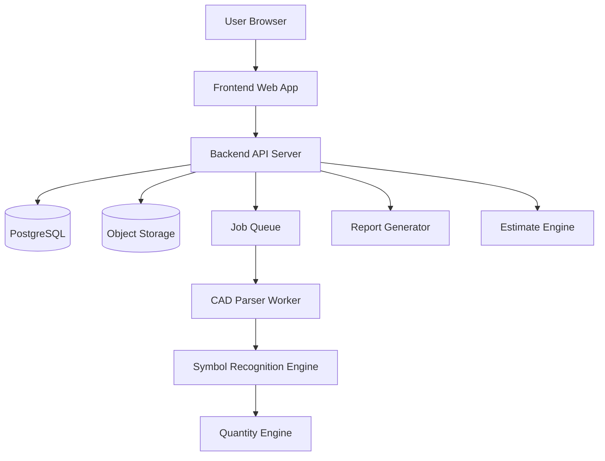

# Voltix 전기자재 자동화 플랫폼 제안서 초안

- 문서명: 통합 사업 및 개발 제안서 초안
- 기반 문서: `01_PRD.md`, `02_FRD.md`, `03_TRD.md`
- 프로젝트명: Voltix 전기자재 자동화 플랫폼
- 작성일: 2026-07-09
- 버전: v0.1 Draft

---

## 1. 제안 개요

Voltix는 전기도면을 업로드하면 도면 내 전기 심볼을 자동으로 인식하고, 주요 전기자재 수량산출부터 자재 품번 매칭, 단가 적용, 견적서 생성, 발주 리스트 작성, 공급 상담까지 연결하는 전기자재 업무 자동화 플랫폼이다.

현재 전기설비 적산 및 견적 업무는 도면 확인, 심볼 카운팅, 엑셀 정리, 자재 품번 대조, 단가 입력, 견적서 작성, 발주 리스트 정리까지 대부분 수작업으로 진행된다. 이 과정은 반복 시간이 길고, 누락·중복·오산출·오입력 위험이 크며, 도면 변경 시 재검토 부담도 크다.

Voltix는 초기 MVP에서 모든 공종의 완전 자동 적산을 목표로 하지 않는다. 공동주택·오피스텔 세대 전기도면에서 반복적으로 등장하는 스위치, 콘센트, 통신 인출구, 통합수구, 세대분전반 등 주요 전기자재부터 자동 산출하고, 실무자가 검수한 뒤 견적·발주 업무로 연결할 수 있는 구조를 우선 구축한다.

---

## 2. 해결하려는 문제

### 2.1 현장 업무의 주요 문제

1. 전기도면 심볼을 사람이 직접 확인하고 카운팅해야 한다.
2. 현장마다 블록명, 레이어명, 심볼 표기 방식이 달라 산출 기준이 흔들린다.
3. 수량산출 이후 자재 품번, 규격, 단가, 견적서 작성이 별도 업무로 분리되어 있다.
4. 엑셀 기반 작업에서 누락, 중복, 오입력, 버전 관리 문제가 발생한다.
5. 설계 변경이나 도면 변경 시 기존 수량을 다시 검토해야 한다.
6. 견적 담당자, 공무 담당자, 유통사 간 동일 데이터를 공유하고 추적하기 어렵다.

### 2.2 핵심 Pain Point

전기도면에서 자재 수량을 뽑는 일은 반복적이지만, 결과가 견적·발주·납기와 바로 연결된다. 따라서 작은 오류도 비용 증가, 발주 누락, 납기 지연으로 이어질 수 있다.

---

## 3. 제품 방향

### 3.1 한 줄 정의

Voltix는 전기도면 기반 전기자재 수량산출을 자동화하고, 산출 결과를 견적·발주·공급 업무까지 연결하는 전기자재 특화 업무 플랫폼이다.

### 3.2 차별화 포인트

| 구분 | 기존 방식 또는 기존 적산 도구 | Voltix 방향 |
|---|---|---|
| 업무 범위 | 도면 기반 수량 산출 중심 | 수량산출, 품번 매칭, 견적, 발주, 공급 연결 |
| 사용자 | 적산 전문가 중심 | 공무, 견적, 유통사, 검토자까지 확장 |
| 운영 방식 | 설치형 또는 파일 중심 | 웹 기반 프로젝트 관리형 플랫폼 |
| 산출물 | 수량표 중심 | 수량표, 견적서, 발주 리스트, 공급 상담 |
| 자동화 전략 | 전체 공종 적산 지향 | 전기자재 반복 품목부터 실무형 자동화 |

---

## 4. 핵심 고객 및 활용 시나리오

| 고객군 | 주요 니즈 | 기대 효과 |
|---|---|---|
| 전기설비 적산 실무자 | 도면에서 반복 자재 수량을 빠르게 산출 | 수작업 카운팅 시간 단축 |
| 전기공사 공무 담당자 | 현장별 수량 검토, 견적 비교, 발주 리스트 작성 | 견적·발주 업무 효율화 |
| 건설사 기전팀 | 설계도면 기준 물량 검토 및 협력사 견적 검증 | 견적 검토 정확도 향상 |
| 감리사 | 설계도면과 산출 물량 비교 | 물량 검토 시간 단축 |
| 설계사무소 | 설계 변경에 따른 수량 변화 확인 | 변경 영향 검토 지원 |
| 전기자재 유통사 | 고객 도면 기반 자재 견적 및 공급 제안 | 견적 대응 속도 향상 |

### 대표 사용자 흐름

1. 사용자가 프로젝트를 생성한다.
2. DWG 또는 DXF 전기도면을 업로드한다.
3. 시스템이 블록명, 레이어명, 좌표, 속성을 추출한다.
4. 시스템이 심볼 유형을 자동 분류한다.
5. 사용자가 심볼과 실제 자재 품목을 매핑한다.
6. 시스템이 자재별 수량을 자동 산출한다.
7. 사용자가 도면 위에서 결과를 검수하고 수정한다.
8. 확정 수량표를 엑셀로 다운로드한다.
9. 단가를 적용해 견적서를 생성한다.
10. 발주 리스트와 공급 상담으로 연결한다.

---

## 5. MVP 범위

### 5.1 포함 범위

| 구분 | MVP 범위 |
|---|---|
| 도면 형식 | DWG 우선, DXF 보조 |
| 도면 종류 | 세대 전기 평면도 |
| 적용 건물 | 공동주택, 오피스텔, 소형 주거시설 |
| 분석 단위 | 프로젝트, 도면, 세대 타입, 층, 구역 |
| 산출 품목 | 스위치, 콘센트, 통신 인출구, 통합수구, 세대분전반 |
| 주요 출력물 | 수량표, 엑셀, 견적서, 발주 리스트 |

### 5.2 제외 또는 후순위 범위

| 항목 | 처리 방향 |
|---|---|
| 모든 공종 통합 적산 | MVP 이후 확장 |
| 건축·기계 적산 | 전기자재 특화 이후 검토 |
| 스캔 PDF 완전 자동 인식 | 후속 고도화 |
| 100% 자동 산출 보장 | 검수형 UX로 보완 |
| BIM 연동 | 후속 기술 검토 |
| ERP 실시간 연동 | PoC 이후 공급사 연동 검토 |

---

## 6. 주요 기능 구성

### 6.1 P1 핵심 기능

| 기능 | 설명 |
|---|---|
| 회원가입/로그인 | 사용자 계정 생성 및 인증 |
| 프로젝트 관리 | 현장명, 고객사, 건물 유형, 세대 타입 등록 |
| 도면 업로드 | DWG/DXF 파일 업로드 및 메타데이터 저장 |
| CAD 정보 추출 | 블록명, 레이어명, 좌표, 속성 추출 |
| 심볼 자동 분류 | 주요 전기 심볼 유형 자동 분류 |
| 심볼-자재 매핑 | 심볼과 실제 자재 품목 연결 |
| 수량 자동 산출 | 자재별·도면별·세대별 수량 집계 |
| 사용자 검수 | 누락, 중복, 오분류를 도면 위에서 수정 |
| 수량표 생성 | 확정 수량표 생성 |
| 엑셀 다운로드 | 수량산출 결과 엑셀 출력 |

### 6.2 P2 확장 기능

| 기능 | 설명 |
|---|---|
| 자재코드 관리 | 품명, 규격, 제조사, 품번, 단위 관리 |
| 단가표 관리 | 자재별 기준가, 공급가, 프로젝트가 관리 |
| 견적서 생성 | 확정 수량과 단가 기반 견적서 생성 |
| 발주 리스트 생성 | 공급 요청용 품목 리스트 생성 |
| 공급 상담 요청 | 산출·견적 결과 기반 상담 연결 |

### 6.3 P3 후속 기능

| 기능 | 설명 |
|---|---|
| PDF 도면 인식 | 벡터 PDF 또는 이미지 PDF 기반 심볼 분석 |
| 도면 변경 비교 | 도면 버전별 수량 차이 비교 |
| AI 심볼 학습 | 검수 데이터를 기반으로 인식률 개선 |

---

## 7. 기술 설계 방향

### 7.1 권장 아키텍처



### 7.2 기술 스택 후보

| 영역 | 권장 기술 |
|---|---|
| Frontend | React / Next.js |
| Backend | NestJS 또는 FastAPI |
| Database | PostgreSQL |
| File Storage | S3 호환 Object Storage |
| Queue | Redis Queue / BullMQ / Celery |
| CAD Parser | ODA File Converter, ezdxf, LibreDWG 검토 |
| Drawing Viewer | SVG / Canvas / WebGL |
| Report | ExcelJS / openpyxl |
| Auth | JWT + Refresh Token |
| Infra | Docker, Nginx, Linux Server |
| Monitoring | Sentry, Prometheus, Grafana |

### 7.3 CAD 분석 전략

초기 MVP는 AI 이미지 인식보다 CAD 객체 정보를 우선 활용한다. DWG/DXF 파일에서 블록명, 레이어명, 좌표, 회전값, 스케일, 속성값을 추출하고, 이를 표준 Symbol 객체로 저장한다.

DWG 직접 파싱이 어렵거나 라이선스 이슈가 있는 경우, DWG를 DXF로 변환한 뒤 DXF를 파싱하는 방식을 병행 검토한다. PDF 분석은 CAD 블록 정보 손실 가능성이 높으므로 후순위로 둔다.

---

## 8. 핵심 데이터 모델

| 테이블 | 역할 |
|---|---|
| users | 사용자 계정, 권한, 회사 정보 |
| projects | 현장 또는 견적 단위 프로젝트 |
| drawings | 도면 파일, 버전, 층, 세대 타입, 분석 상태 |
| symbols | 도면에서 추출된 심볼 후보 및 좌표 정보 |
| materials | 자재명, 규격, 제조사, 품번, 단위 |
| symbol_material_mappings | 심볼과 자재의 매핑 규칙 |
| quantity_results | 자동 산출 수량 및 검수 후 확정 수량 |
| prices | 자재별 단가와 적용 기간 |
| estimates | 견적서 헤더, 금액, 상태 |
| estimate_items | 견적서 품목별 수량, 단가, 금액 |
| audit_logs | 수량, 단가, 견적 등 주요 변경 이력 |

---

## 9. 수량산출 및 검수 기준

### 9.1 기본 산출 로직

```text
자재별 수량 = 해당 material_id로 매핑된 symbol 개수
도면별 수량 = drawing_id 기준 자재별 수량 합계
세대 타입별 수량 = unit_type 기준 자재별 수량 합계
프로젝트 총 수량 = 세대 타입별 수량 × 세대 타입별 세대 수
견적 수량 = 검수 후 확정 수량
```

### 9.2 검수 UX 원칙

1. 자동 산출 결과를 바로 확정하지 않고 검수 상태를 둔다.
2. 신뢰도 낮은 심볼과 미매핑 심볼을 우선 표시한다.
3. 도면 위 심볼 위치와 수량표가 연결되어야 한다.
4. 사용자는 심볼 추가, 제외, 재매핑, 수량 재계산을 할 수 있어야 한다.
5. 확정 이후 수정 시 재검수 상태로 되돌리고 감사 로그를 남긴다.

---

## 10. 성과 지표

| 지표 | 목표 |
|---|---|
| 자동 인식률 | MVP 기준 80% 이상 목표 |
| 검수 후 정확도 | 수작업 산출 결과 대비 95% 이상 목표 |
| 견적서 생성 시간 | 수량 확정 후 10분 이내 목표 |
| 50MB 이하 DWG 분석 | 5분 이내 목표 |
| 엑셀 재작업률 | PoC 이후 단계적 감소 |
| PoC 고객 만족도 | 5점 만점 4점 이상 목표 |

---

## 11. 개발 로드맵 초안

| 단계 | 기간 | 주요 내용 |
|---|---|---|
| 1단계 | 1개월 | 상세 요구사항 정리, 샘플 도면 확보, CAD Parser 기술 검토 |
| 2단계 | 1~2개월 | 프로젝트 관리, 도면 업로드, 파일 저장, 메타데이터 관리 |
| 3단계 | 2~3개월 | CAD Parser 연동, 블록/레이어/좌표 추출, 심볼 목록 생성 |
| 4단계 | 1개월 | 심볼 분류, 심볼-자재 매핑, 수량산출, 검수 UI |
| 5단계 | 1개월 | 자재코드, 단가표, 엑셀 수량표 출력 |
| 6단계 | 1개월 | 견적서 생성, 발주 리스트, PoC 테스트 |

MVP 개발 기간은 약 6~9개월을 기준으로 검토한다.

---

## 12. PoC 계획

### 12.1 필요 자료

- 실제 DWG 전기도면 5~10개
- 수작업 산출 엑셀
- 주요 심볼 종류 정의서
- 주요 자재 품목표
- 제조사 품번표
- 단가표 샘플
- PoC 검증 담당자 또는 고객사

### 12.2 검증 항목

1. DWG/DXF 업로드 및 분석 성공률
2. 블록명, 레이어명, 좌표 추출 정확도
3. 주요 심볼 자동 분류율
4. 수작업 산출 결과 대비 검수 후 정확도
5. 기존 업무 대비 수량산출 시간 절감 효과
6. 엑셀 수량표 및 견적서 재작업률
7. 실무자 사용성 및 검수 편의성

---

## 13. 주요 리스크 및 대응

| 리스크 | 설명 | 대응 방향 |
|---|---|---|
| DWG 파싱 호환성 | DWG 버전별 파싱 차이 발생 가능 | DXF 변환 방식 병행 검토 |
| CAD 라이선스 | 상용 라이브러리 도입 필요 가능 | 초기 기술 검토 단계에서 확인 |
| 도면 표준화 부족 | 현장마다 블록·레이어 규칙 상이 | 사용자 정의 매핑 규칙 저장 |
| 자동 결과 신뢰 문제 | 실무자가 자동 산출 결과를 바로 신뢰하기 어려움 | 검수형 UI와 신뢰도 표시 제공 |
| PDF 인식 한계 | PDF는 CAD 객체 정보 손실 가능 | DWG/DXF 우선, PDF 후속 개발 |
| 개발 범위 과대 | 모든 전기설비로 확장 시 일정 지연 | 배선기구 중심 MVP로 제한 |

---

## 14. MVP 완료 기준

1. 사용자는 계정으로 로그인할 수 있다.
2. 사용자는 프로젝트를 생성하고 도면을 업로드할 수 있다.
3. 시스템은 DWG/DXF 도면에서 블록명, 레이어명, 좌표 정보를 추출할 수 있다.
4. 사용자는 인식된 심볼을 자재 품목과 매핑할 수 있다.
5. 시스템은 주요 전기자재 수량을 자동 산출할 수 있다.
6. 사용자는 자동 산출 결과를 도면 위에서 검수하고 수정할 수 있다.
7. 시스템은 품목별 수량표를 생성할 수 있다.
8. 사용자는 수량표를 엑셀로 다운로드할 수 있다.
9. 사용자는 자재코드와 단가를 등록할 수 있다.
10. 시스템은 확정 수량과 단가를 기반으로 견적서를 생성할 수 있다.
11. 시스템은 발주 리스트를 생성할 수 있다.
12. 분석 실패, 미매핑, 권한 부족 등 주요 예외 상황을 처리할 수 있다.

---

## 15. 다음 액션

1. 실제 DWG 샘플 도면과 수작업 산출표를 확보한다.
2. 주요 심볼 유형과 자재 품목 기준표를 확정한다.
3. DWG 파서 후보를 비교하고 라이선스·정확도·운영 가능성을 검토한다.
4. 도면 뷰어 구현 방식을 SVG, Canvas, WebGL 중에서 결정한다.
5. PoC 고객 또는 내부 검증자를 지정한다.
6. Sprint 1 범위를 회원/권한, 프로젝트 관리, 도면 업로드, 파일 저장으로 확정한다.

---

## 16. 초안 결론

Voltix MVP의 핵심은 완전 자동 적산이 아니라, 전기도면 내 반복 자재 심볼을 빠르게 추출하고 실무자가 검수한 뒤 견적·발주 업무로 연결할 수 있는 실무형 워크플로우를 만드는 것이다.

따라서 초기 개발은 DWG/DXF 기반 CAD 객체 분석, 규칙 기반 심볼 분류, 사용자 정의 매핑, 검수형 수량산출, 엑셀 출력, 자재코드·단가 기반 견적 생성 순서로 진행하는 것이 가장 현실적이다. 이후 PoC 데이터를 기반으로 PDF 인식, AI 심볼 학습, 도면 변경 비교, ERP 연동, 공급사 단가 비교 기능으로 확장할 수 있다.
