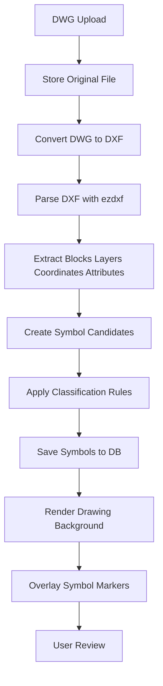

# Voltix CAD Parser·도면 뷰어 기술 검토 체크리스트

- 문서명: CAD Parser 및 도면 뷰어 기술 검토 체크리스트
- 목적: DWG/DXF 분석 방식과 웹 도면 뷰어 구현 방식 선정
- 작성일: 2026-07-09
- 버전: v0.1 Draft

---

## 1. 검토 결론 초안

MVP 1차 권장안은 다음과 같다.

1. DWG 파일은 서버에서 DXF로 변환한다.
2. DXF 파일은 Python `ezdxf`로 파싱한다.
3. 파싱 대상은 `INSERT`, `BLOCK`, `LAYER`, `TEXT`, `MTEXT`, attributes, 좌표, 회전값, 스케일로 제한한다.
4. 도면 배경은 SVG로 변환해 표시하고, 심볼 검수 오버레이는 별도 좌표 레이어로 구현한다.
5. 초기에는 완전한 CAD 편집기를 만들지 않고, 보기·선택·필터·검수 중심 뷰어로 제한한다.

이 방향은 MVP에서 필요한 “심볼 추출, 수량산출, 검수”에 집중하면서 DWG 직접 파싱 리스크를 줄이기 위한 선택이다.

---

## 2. 공식 문서 확인 근거

| 항목 | 확인 내용 | 출처 |
|---|---|---|
| ezdxf | Python 기반 DXF 읽기·수정·쓰기 지원, MIT License, DXF R12~R2018 지원 | https://ezdxf.readthedocs.io/en/stable/ |
| ODA File Converter | DWG/DXF 간 버전 및 형식 변환 지원, GUI와 CLI 입력 지원 | https://www.opendesign.com/guestfiles/oda_file_converter |
| LibreDWG | DWG 처리를 위한 GNU C 라이브러리, beta 단계, GPLv3 계열 라이선스 | https://www.gnu.org/software/libredwg/ |
| Autodesk APS Automation API | Autodesk 공식 클라우드 자동화 API 후보 | https://aps.autodesk.com/apis-and-services/automation-api |

확인일: 2026-07-09

---

## 3. CAD Parser 후보 비교

| 후보 | 장점 | 리스크 | MVP 판단 |
|---|---|---|---|
| ODA File Converter + ezdxf | DWG를 DXF로 변환한 뒤 안정적으로 DXF 파싱 가능 | ODA 사용 조건, 설치 방식, 서버 운영 조건 확인 필요 | 1차 권장 |
| ezdxf 단독 | MIT License, Python 친화적, DXF 처리에 강함 | DWG 직접 파싱 불가 | DXF 파서로 채택 권장 |
| LibreDWG | 오픈소스 DWG 처리 가능성 | GPLv3 라이선스, beta 단계, 운영 안정성 검증 필요 | 보조 검토 |
| Autodesk APS Automation API | Autodesk 공식 생태계, AutoCAD 기반 처리 가능성 | 클라우드 의존성, 비용, API 사용 제약 검토 필요 | 장기 검토 |
| 상용 CAD SDK | DWG 호환성 기대 | 비용, 라이선스, 서버 배포 제약 | PoC 이후 검토 |

---

## 4. Parser 검증 체크리스트

### 4.1 파일 처리

| 체크 항목 | 기준 | 결과 |
|---|---|---|
| DWG 업로드 가능 | 50MB 이하 파일 저장 가능 | 미확인 |
| DXF 변환 가능 | DWG 샘플 5개 중 4개 이상 변환 성공 | 미확인 |
| 변환 시간 | 50MB 이하 파일 1개 30초 이내 목표 | 미확인 |
| 변환 실패 로그 | 실패 원인과 파일명 저장 | 미확인 |
| 원본 보존 | 원본 DWG와 변환 DXF 분리 저장 | 설계 필요 |

### 4.2 엔티티 추출

| 체크 항목 | 추출 대상 | 필수 |
|---|---|---|
| 블록 참조 | INSERT | Y |
| 블록 정의 | BLOCK | Y |
| 레이어 | LAYER | Y |
| 좌표 | insert point x, y | Y |
| 회전값 | rotation | Y |
| 스케일 | xscale, yscale | Y |
| 속성값 | ATTRIB, ATTDEF | Y |
| 텍스트 | TEXT, MTEXT | 권장 |
| 도면 단위 | INSUNITS 등 | 권장 |

### 4.3 심볼 후보 생성

| 체크 항목 | 기준 | 결과 |
|---|---|---|
| block_name 저장 | 원본 블록명 유지 | 미확인 |
| layer_name 저장 | 레이어명 유지 | 미확인 |
| position 저장 | 좌표 정확도 유지 | 미확인 |
| attributes 저장 | JSON 형태 저장 가능 | 미확인 |
| 텍스트 인접 분석 | 심볼 주변 텍스트 연결 가능성 검토 | 후순위 |

---

## 5. 도면 뷰어 후보 비교

| 방식 | 장점 | 리스크 | MVP 판단 |
|---|---|---|---|
| SVG 배경 + 좌표 오버레이 | 구현 단순, 확대/선택 처리 쉬움, 웹 친화적 | 대용량 도면에서 성능 저하 가능 | 1차 권장 |
| Canvas 렌더링 | 대량 객체 렌더링 성능 유리 | 선택·접근성·객체별 스타일 관리 복잡 | 대용량 대응 후보 |
| WebGL | 초대형 도면과 고성능 렌더링 가능 | 개발 복잡도 높음 | 후순위 |
| PDF/이미지 변환 표시 | 빠르게 미리보기 가능 | 정확한 좌표 오버레이 어려움 | 보조 미리보기 |

---

## 6. MVP 뷰어 요구사항

| 기능 | 설명 | 우선순위 |
|---|---|---|
| 도면 표시 | 변환된 SVG 또는 Canvas 배경 표시 | P1 |
| 확대/축소 | 마우스 휠, 버튼, 터치패드 대응 | P1 |
| 이동 | 드래그 팬 | P1 |
| 심볼 오버레이 | 추출 좌표 기준 마커 표시 | P1 |
| 심볼 클릭 | 우측 속성 패널 표시 | P1 |
| 품목 필터 | 스위치, 콘센트, 통신 등 필터 | P1 |
| 상태 필터 | 미매핑, 검수필요, 검수완료 필터 | P1 |
| 심볼 제외 | 수량산출 제외 처리 | P1 |
| 심볼 재매핑 | 다른 자재 품목으로 변경 | P1 |
| 심볼 추가 | 누락 심볼 수동 추가 | P2 |
| 도면 비교 | 버전별 차이 비교 | P3 |

---

## 7. 권장 처리 파이프라인

---

## 8. 기술 검증 시나리오

### 8.1 샘플 도면 1개 기준

1. DWG 파일을 업로드한다.
2. 원본 파일을 저장한다.
3. DWG를 DXF로 변환한다.
4. DXF에서 `INSERT` 엔티티를 추출한다.
5. 각 엔티티의 블록명, 레이어명, 좌표, 회전값, 스케일, 속성을 저장한다.
6. 심볼 후보 목록을 CSV 또는 JSON으로 출력한다.
7. 도면 배경 SVG를 생성한다.
8. SVG 위에 심볼 좌표를 오버레이한다.
9. 수작업 산출표와 후보 심볼 수량을 비교한다.

### 8.2 성공 기준

| 항목 | 기준 |
|---|---|
| 변환 성공률 | 샘플 DWG 5개 중 4개 이상 |
| 블록 추출률 | 수작업 기준 주요 심볼 80% 이상 후보 추출 |
| 좌표 표시 | 도면 위 마커 위치가 육안으로 일치 |
| 처리 시간 | 50MB 이하 도면 5분 이내 분석 |
| 재현성 | 동일 파일 재분석 시 동일 결과 생성 |

---

## 9. 결정해야 할 사항

1. 서버 OS를 Linux로 둘 경우 ODA File Converter 설치와 실행이 가능한가?
2. ODA File Converter 사용 조건이 상용 SaaS 운영에 적합한가?
3. DWG를 반드시 서버에서 처리해야 하는가, 내부 PC 변환 후 업로드도 허용할 것인가?
4. 도면 SVG 변환 품질이 실무 검수에 충분한가?
5. 대용량 도면에서 SVG 성능 문제가 발생하면 Canvas로 전환할 기준은 무엇인가?
6. CAD Parser 실패 시 사용자가 재업로드해야 하는가, 다른 변환 옵션을 자동 시도할 것인가?

---

## 10. 1차 권장 의사결정

| 항목 | 권장안 |
|---|---|
| MVP 파싱 전략 | DWG를 DXF로 변환 후 DXF 파싱 |
| DXF 파서 | ezdxf |
| DWG 변환 후보 | ODA File Converter 우선 검증 |
| 보조 후보 | LibreDWG, Autodesk APS Automation API |
| 뷰어 | SVG 배경 + 심볼 좌표 오버레이 |
| 대용량 대응 | 성능 이슈 발생 시 Canvas 검토 |
| 저장 방식 | 원본 DWG, 변환 DXF, 뷰어용 SVG 분리 저장 |

---

## 11. 다음 작업

1. 실제 샘플 DWG 1개를 확보한다.
2. 로컬 또는 서버 환경에서 DXF 변환 테스트를 진행한다.
3. `ezdxf`로 `INSERT`, `BLOCK`, `LAYER` 추출 샘플을 만든다.
4. 추출 결과를 `symbols` 테이블 구조에 맞춰 JSON으로 정리한다.
5. SVG 변환 결과와 좌표 오버레이 정확도를 확인한다.
6. 샘플 5개 이상에서 변환 성공률과 추출률을 측정한다.
