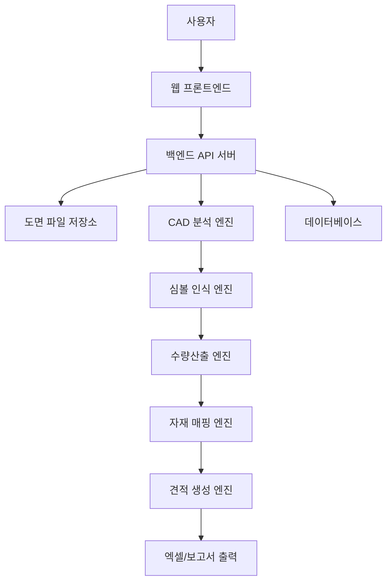

# 볼틱스 개발 초안 v0.1

## 전기도면 기반 전기자재 수량산출·견적·공급 자동화 플랫폼

---

## 1. 프로젝트 개요

볼틱스는 전기도면을 업로드하면 도면 내 전기 심볼을 자동으로 인식하여 스위치, 콘센트, 통신 인출구, 통합수구, 세대분전반 등 주요 전기자재 수량을 산출하고, 이를 실제 자재 품번·단가·견적서·발주 리스트·공급 상담까지 연결하는 전기자재 업무 자동화 플랫폼이다.

기존 전기설비 적산 업무는 도면을 수작업으로 확인하고, 품목별 수량을 엑셀로 정리한 뒤, 별도 단가표와 자재 품번을 대조하여 견적서를 작성하는 방식으로 진행된다. 이 과정은 시간이 오래 걸리고, 누락·중복·오산출 가능성이 높다.

볼틱스는 이러한 반복 업무를 자동화하여 전기공사 견적 담당자, 공무 담당자, 건설사 기전팀, 감리사, 설계사무소, 전기자재 유통사의 업무 효율을 높이는 것을 목표로 한다.

---

## 2. 핵심 목표

### 2.1 서비스 목표

전기도면 기반 수량산출부터 견적·공급까지 연결되는 전기자재 업무 자동화 플랫폼 구축

### 2.2 세부 목표

| 구분     | 목표                                       |
| ------ | ---------------------------------------- |
| 도면 분석  | DWG 또는 PDF 전기도면 업로드 후 전기 심볼 자동 인식        |
| 수량산출   | 스위치, 콘센트, 통신, 통합수구, 세대분전반 등 주요 품목 자동 카운팅 |
| 검수 기능  | 자동 산출 결과를 사용자가 도면 위에서 확인·수정 가능           |
| 자재 매핑  | 심볼을 실제 자재 품명, 규격, 품번과 연결                 |
| 견적 자동화 | 수량과 단가를 기반으로 견적서 자동 생성                   |
| 공급 연결  | 산출 결과를 발주 리스트와 공급 상담으로 연결                |
| 데이터 축적 | 프로젝트별 도면, 수량, 견적, 자재 데이터를 누적 관리          |

---

## 3. 주요 대상 사용자

| 사용자         | 주요 니즈                          |
| ----------- | ------------------------------ |
| 전기설비 적산 실무자 | 도면 기반 전기자재 수량을 빠르고 정확하게 산출     |
| 전기공사 공무 담당자 | 현장별 자재 수량 확인, 견적 비교, 발주 리스트 작성 |
| 건설사 기전팀     | 설계도면 기준 물량 검토 및 견적 검증          |
| 감리사         | 도면과 실제 수량 간 차이 검토              |
| 설계사무소       | 설계 변경에 따른 수량 변화 확인             |
| 전기자재 유통사    | 고객 도면 기반 자재 견적 및 공급 제안         |

---

## 4. 핵심 문제 정의

현재 전기자재 수량산출 업무는 다음과 같은 문제가 있다.

1. 도면을 사람이 직접 확인하며 심볼을 카운팅해야 한다.
2. 스위치, 콘센트, 통신 인출구 등 반복 품목이 많아 시간이 오래 걸린다.
3. 도면별 심볼 표기 방식이 달라 수량산출 기준이 일관되지 않다.
4. 수량산출 후 자재 품번, 단가, 견적서 작성 업무가 별도로 진행된다.
5. 엑셀 작업 중 누락, 중복, 오입력 가능성이 높다.
6. 견적 담당자, 공무 담당자, 자재 유통사 간 데이터 공유가 어렵다.
7. 도면 변경 시 기존 수량을 다시 검토해야 한다.

---

## 5. 볼틱스 해결 방식

볼틱스는 전기도면을 분석하여 전기 심볼을 자동 인식하고, 품목별 수량을 자동 산출한다. 산출된 수량은 사용자가 검수할 수 있으며, 이후 자재코드, 품번, 단가, 견적서, 발주 리스트로 연결된다.

핵심 흐름은 다음과 같다.

> 도면 업로드 → 심볼 자동 인식 → 품목별 수량산출 → 사용자 검수 → 자재 품번 매핑 → 견적서 생성 → 발주 리스트 생성 → 공급 상담 연결

---

## 6. MVP 개발 범위

초기 버전은 모든 전기설비 적산이 아니라, **공동주택·오피스텔 세대 전기도면의 배선기구 수량산출**에 집중한다.

### 6.1 1차 MVP 대상 도면

| 구분    | 내용                 |
| ----- | ------------------ |
| 도면 형식 | DWG 우선, PDF는 2차 적용 |
| 도면 종류 | 세대 전기 평면도          |
| 적용 건물 | 아파트, 오피스텔, 소형 주거시설 |
| 분석 단위 | 세대 타입별, 층별, 구역별    |

### 6.2 1차 자동 카운팅 대상

| 분류    | 품목                      |
| ----- | ----------------------- |
| 배선기구  | 스위치, 콘센트                |
| 통신    | 전화, TV, LAN, 통신 인출구     |
| 통합수구  | 통합형 정보통신 수구             |
| 분전    | 세대분전반                   |
| 확장 후보 | 전등, 감지기, 월패드, 비디오폰, 배선관 |

---

## 7. 주요 기능 정의

| 기능명       | 설명                            | 우선순위  |
| --------- | ----------------------------- | ----- |
| 회원가입/로그인  | 사용자 계정 생성 및 프로젝트 관리           | 1순위   |
| 프로젝트 생성   | 현장명, 건물명, 세대 타입, 도면 정보 등록     | 1순위   |
| 도면 업로드    | DWG 파일 업로드 및 도면 정보 저장         | 1순위   |
| 도면 미리보기   | 웹 화면에서 도면 확인                  | 1순위   |
| CAD 심볼 분석 | 도면 내 블록, 레이어, 심볼 정보 추출        | 1순위   |
| 심볼 자동 카운팅 | 스위치, 콘센트, 통신, 통합수구, 분전반 수량 산출 | 1순위   |
| 심볼 매핑     | 도면 심볼과 실제 자재 품목 연결            | 1순위   |
| 사용자 검수    | 자동 인식 결과 확인, 수정, 추가, 삭제       | 1순위   |
| 수량표 생성    | 품목별·세대별·층별 수량 집계              | 1순위   |
| 엑셀 다운로드   | 수량산출 결과 엑셀 출력                 | 1순위   |
| 자재코드 등록   | 표준 품명, 규격, 품번 등록              | 2순위   |
| 단가표 등록    | 자재별 공급 단가 등록                  | 2순위   |
| 견적서 생성    | 수량 × 단가 기준 견적서 생성             | 2순위   |
| 발주 리스트 생성 | 견적 결과 기반 발주용 목록 생성            | 2순위   |
| 공급 상담 요청  | 산출 결과를 기반으로 공급 상담 접수          | 2순위   |
| PDF 도면 인식 | PDF 도면에서 심볼 인식                | 3순위   |
| 도면 변경 비교  | 변경 전후 수량 차이 비교                | 3순위   |
| BIM 연동    | BIM 모델 기반 후속 수량산출             | 장기 과제 |

---

## 8. 사용자 흐름

### 8.1 기본 사용 흐름

1. 사용자가 로그인한다.
2. 새 프로젝트를 생성한다.
3. 현장명, 건물명, 세대 타입 정보를 입력한다.
4. DWG 전기도면을 업로드한다.
5. 시스템이 도면 내 블록, 레이어, 심볼 정보를 분석한다.
6. 사용자가 심볼과 자재 품목을 매핑한다.
7. 시스템이 스위치, 콘센트, 통신, 통합수구, 세대분전반 수량을 자동 산출한다.
8. 사용자는 도면 위에서 자동 인식 결과를 검수한다.
9. 수정 완료 후 최종 수량표를 확정한다.
10. 엑셀 수량표를 다운로드한다.
11. 자재 단가를 적용해 견적서를 생성한다.
12. 발주 리스트 또는 공급 상담 요청으로 연결한다.

---

## 9. 핵심 화면 구성

| 화면         | 주요 기능                       |
| ---------- | --------------------------- |
| 대시보드       | 프로젝트 목록, 최근 도면, 견적 진행 상태 확인 |
| 프로젝트 등록 화면 | 현장명, 발주처, 건물 유형, 세대 타입 입력   |
| 도면 업로드 화면  | DWG/PDF 업로드, 도면명, 도면 버전 등록  |
| 도면 분석 화면   | 도면 미리보기, 심볼 자동 인식 결과 표시     |
| 심볼 매핑 화면   | 심볼별 자재명, 규격, 품번 연결          |
| 수량 검수 화면   | 자동 카운팅 결과 확인, 누락/오류 수정      |
| 수량표 화면     | 품목별·층별·세대별 수량 집계            |
| 견적서 화면     | 단가 적용, 금액 산출, 견적서 생성        |
| 발주 리스트 화면  | 공급 요청 품목, 수량, 납기, 비고 관리     |
| 관리자 화면     | 자재코드, 단가표, 사용자, 프로젝트 관리     |

---

## 10. 데이터 구조 초안

### 10.1 Project

| 필드            | 설명         |
| ------------- | ---------- |
| project_id    | 프로젝트 고유 ID |
| project_name  | 프로젝트명      |
| client_name   | 고객사명       |
| site_name     | 현장명        |
| building_type | 건물 유형      |
| created_by    | 생성 사용자     |
| created_at    | 생성일        |
| updated_at    | 수정일        |

### 10.2 Drawing

| 필드              | 설명            |
| --------------- | ------------- |
| drawing_id      | 도면 고유 ID      |
| project_id      | 연결 프로젝트 ID    |
| drawing_name    | 도면명           |
| file_type       | DWG, DXF, PDF |
| file_path       | 파일 저장 경로      |
| drawing_version | 도면 버전         |
| floor_info      | 층 정보          |
| unit_type       | 세대 타입         |
| uploaded_at     | 업로드일          |

### 10.3 Symbol

| 필드               | 설명             |
| ---------------- | -------------- |
| symbol_id        | 심볼 고유 ID       |
| drawing_id       | 도면 ID          |
| block_name       | CAD 블록명        |
| layer_name       | CAD 레이어명       |
| symbol_type      | 심볼 유형          |
| position_x       | X 좌표           |
| position_y       | Y 좌표           |
| confidence_score | 인식 신뢰도         |
| status           | 자동인식, 수정됨, 제외됨 |

### 10.4 Material

| 필드            | 설명       |
| ------------- | -------- |
| material_id   | 자재 고유 ID |
| category      | 자재 분류    |
| material_name | 자재명      |
| specification | 규격       |
| brand         | 제조사      |
| model_code    | 품번       |
| unit          | 단위       |
| base_price    | 기준 단가    |

### 10.5 SymbolMaterialMapping

| 필드          | 설명       |
| ----------- | -------- |
| mapping_id  | 매핑 고유 ID |
| symbol_type | 심볼 유형    |
| block_name  | CAD 블록명  |
| material_id | 연결 자재 ID |
| rule_name   | 매핑 규칙명   |

### 10.6 QuantityResult

| 필드                | 설명           |
| ----------------- | ------------ |
| result_id         | 산출 결과 ID     |
| project_id        | 프로젝트 ID      |
| drawing_id        | 도면 ID        |
| material_id       | 자재 ID        |
| unit_type         | 세대 타입        |
| floor_info        | 층 정보         |
| quantity          | 산출 수량        |
| verified_quantity | 검수 후 수량      |
| status            | 임시, 검수완료, 확정 |

### 10.7 Estimate

| 필드              | 설명          |
| --------------- | ----------- |
| estimate_id     | 견적 ID       |
| project_id      | 프로젝트 ID     |
| estimate_name   | 견적명         |
| total_amount    | 총 금액        |
| estimate_status | 작성중, 확정, 발송 |
| created_at      | 생성일         |

### 10.8 EstimateItem

| 필드               | 설명       |
| ---------------- | -------- |
| estimate_item_id | 견적 품목 ID |
| estimate_id      | 견적 ID    |
| material_id      | 자재 ID    |
| quantity         | 수량       |
| unit_price       | 적용 단가    |
| amount           | 금액       |
| note             | 비고       |

---

## 11. 기술 구조 초안

### 11.1 전체 아키텍처

### 11.2 주요 모듈

| 모듈                        | 역할                                |
| ------------------------- | --------------------------------- |
| Frontend                  | 도면 업로드, 도면 뷰어, 검수 UI, 수량표, 견적서 화면 |
| Backend API               | 사용자, 프로젝트, 도면, 자재, 견적 데이터 처리      |
| CAD Parser                | DWG/DXF 블록, 레이어, 좌표, 속성 정보 추출     |
| Symbol Recognition Engine | 전기 심볼 자동 분류 및 카운팅                 |
| Mapping Engine            | 심볼과 자재 품목 연결                      |
| Quantity Engine           | 품목별·층별·세대별 수량 집계                  |
| Estimate Engine           | 단가 적용 및 견적 금액 계산                  |
| Report Generator          | 엑셀 수량표, 견적서, 발주 리스트 생성            |
| Admin Module              | 자재코드, 단가표, 심볼 매핑 규칙 관리            |

---

## 12. 개발 방식

### 12.1 1단계: 규칙 기반 자동 카운팅

초기에는 AI 모델보다 CAD 블록명, 레이어명, 심볼명, 범례 정보를 활용한 규칙 기반 방식으로 개발한다.

예시:

| CAD 정보  | 매핑 결과  |
| ------- | ------ |
| SW_1    | 1구 스위치 |
| SW_2    | 2구 스위치 |
| CON_2   | 2구 콘센트 |
| LAN     | 통신 인출구 |
| TV      | TV 수구  |
| PANEL_H | 세대분전반  |

### 12.2 2단계: 사용자 정의 심볼 매핑

현장마다 심볼 표기가 다르기 때문에 사용자가 직접 심볼을 자재 품목과 연결할 수 있어야 한다.

필수 기능:

1. 도면에서 인식된 심볼 목록 표시
2. 심볼별 자재 품목 선택
3. 매핑 규칙 저장
4. 동일 프로젝트 내 반복 적용
5. 향후 다른 프로젝트에 매핑 규칙 복사

### 12.3 3단계: AI 기반 심볼 인식

도면 이미지, 벡터 PDF, 스캔 도면 등에서는 AI 기반 이미지 인식이 필요하다.
다만 초기 MVP에서는 DWG 기반 규칙 분석을 우선하고, AI 인식은 2차 고도화 기능으로 개발한다.

---

## 13. 정확도 전략

볼틱스는 초기부터 “100% 자동 적산”을 목표로 하지 않는다.
실무 적용성을 높이기 위해 “자동 산출 + 사용자 검수” 구조로 설계한다.

### 13.1 정확도 기준

| 구분       | 기준                      |
| -------- | ----------------------- |
| 자동 인식률   | MVP 기준 80% 이상 목표        |
| 검수 후 정확도 | 사용자 확인 후 95% 이상 목표      |
| 오류 처리    | 누락, 중복, 오분류 항목 수동 수정 가능 |
| 신뢰도 표시   | 심볼별 인식 신뢰도 표시           |

### 13.2 검수 기능

1. 도면 위 인식 심볼 하이라이트 표시
2. 품목별 카운팅 결과 표시
3. 누락 심볼 수동 추가
4. 잘못 인식된 심볼 제외
5. 자재 품목 재매핑
6. 검수 완료 후 수량 확정

---

## 14. 견적 및 공급 연결 구조

볼틱스의 차별점은 수량산출 이후의 업무까지 연결하는 것이다.

### 14.1 견적 자동화

| 항목 | 내용                       |
| -- | ------------------------ |
| 수량 | 도면 기반 자동 산출 수량           |
| 자재 | 품명, 규격, 품번, 제조사          |
| 단가 | 관리자 등록 단가 또는 프로젝트별 적용 단가 |
| 금액 | 수량 × 단가                  |
| 출력 | 엑셀 견적서, 발주 리스트           |

### 14.2 공급 연결

1. 확정 수량 기준 발주 리스트 생성
2. 자재별 공급 가능 여부 확인
3. 견적 상담 요청
4. 납기, 단가, 대체품 제안 관리
5. 전기자재 유통사와 연결

---

## 15. 차별화 포인트

| 기존 적산 프로그램    | 볼틱스                    |
| ------------- | ---------------------- |
| 도면 기반 수량산출 중심 | 수량산출 + 견적 + 공급 연결      |
| 프로그램 설치형 중심   | 웹 기반 프로젝트 관리형 플랫폼      |
| 적산 전문가 중심     | 견적 담당자, 공무, 유통사도 사용 가능 |
| 수량표 출력 중심     | 자재 품번, 단가, 발주 리스트까지 연결 |
| 공종 전체 적산 지향   | 전기자재 특화 자동화            |
| 수동 업무 보조      | 반복 견적·구매 업무 자동화        |

---

## 16. MVP 개발 일정 초안

| 단계  | 기간    | 주요 개발 내용                    |
| --- | ----- | --------------------------- |
| 1단계 | 1개월   | 요구사항 정의, 샘플 도면 수집, 자재코드 정리  |
| 2단계 | 1~2개월 | 프로젝트/도면 업로드/도면 뷰어 개발        |
| 3단계 | 2~3개월 | DWG 블록·레이어 분석, 심볼 카운팅 엔진 개발 |
| 4단계 | 1개월   | 심볼 매핑, 사용자 검수 기능 개발         |
| 5단계 | 1개월   | 수량표, 엑셀 출력, 자재코드 연동         |
| 6단계 | 1개월   | 단가 적용, 견적서, 발주 리스트 기능       |
| 7단계 | 1개월   | 테스트, 정확도 검증, PoC 고객 적용      |

총 MVP 개발 기간은 약 6~9개월을 기준으로 검토한다.

---

## 17. 개발 전 확보해야 할 자료

| 자료             | 필요 이유             |
| -------------- | ----------------- |
| 실제 DWG 전기도면 샘플 | 심볼, 레이어, 블록 구조 분석 |
| 세대 타입별 전기도면    | 타입별 수량산출 검증       |
| 기존 수작업 수량산출 엑셀 | 자동 산출 결과 비교 기준    |
| 전기자재 품목표       | 자재 매핑 기준          |
| 르그랑 등 제조사 품번표  | 실제 견적·공급 연동       |
| 단가표            | 견적 자동화            |
| 현장별 수량산출 기준    | 실무 로직 반영          |
| 적산 담당자 인터뷰     | 실제 업무 흐름 검증       |

---

## 18. 주요 리스크 및 대응 방안

| 리스크       | 설명                        | 대응 방안                 |
| --------- | ------------------------- | --------------------- |
| 도면 형식 다양성 | 현장마다 DWG 구조, 레이어, 블록명이 다름 | 사용자 정의 심볼 매핑 제공       |
| PDF 인식 한계 | PDF 변환 시 CAD 블록 정보 손실     | DWG 우선 적용, PDF는 2차 개발 |
| 심볼 표준화 부족 | 같은 자재도 다른 심볼로 표현 가능       | 프로젝트별 매핑 규칙 저장        |
| 정확도 이슈    | 자동 산출 결과가 실무 기준과 다를 수 있음  | 사용자 검수 UI 제공          |
| 단가 변동     | 자재 단가가 현장, 시기, 조건에 따라 달라짐 | 관리자 단가표 및 프로젝트별 단가 적용 |
| 개발 범위 과대  | 전기 전체 적산으로 확장 시 복잡도 증가    | 배선기구 중심 MVP로 시작       |
| 경쟁 제품 존재  | 기존 적산 프로그램과 기능이 겹칠 수 있음   | 견적·공급 연결로 차별화         |

---

## 19. 수용 기준

MVP 개발 완료 기준은 다음과 같다.

1. 사용자가 프로젝트를 생성할 수 있다.
2. 사용자가 DWG 도면을 업로드할 수 있다.
3. 시스템이 도면 내 주요 CAD 블록과 레이어를 추출할 수 있다.
4. 사용자가 심볼과 자재 품목을 매핑할 수 있다.
5. 시스템이 스위치, 콘센트, 통신, 통합수구, 세대분전반 수량을 자동 산출할 수 있다.
6. 사용자가 자동 산출 결과를 수정·삭제·추가할 수 있다.
7. 품목별 수량표를 확인할 수 있다.
8. 수량표를 엑셀로 다운로드할 수 있다.
9. 자재코드와 단가를 적용할 수 있다.
10. 견적서와 발주 리스트를 생성할 수 있다.
11. 자동 산출 결과와 수작업 산출 결과를 비교할 수 있다.
12. PoC 도면 기준 실무자가 검수 가능한 수준의 결과를 제공한다.

---

## 20. 향후 확장 방향

| 확장 기능     | 설명                         |
| --------- | -------------------------- |
| PDF 도면 인식 | 벡터 PDF 및 이미지 PDF 심볼 인식     |
| AI 심볼 학습  | 사용자 검수 데이터를 기반으로 심볼 인식률 개선 |
| 도면 변경 비교  | 변경 도면 업로드 시 수량 차이 자동 비교    |
| BIM 연동    | BIM 모델 기반 자재 수량산출 연동       |
| 내역서 연동    | 표준 내역서 양식과 수량 자동 연결        |
| 발주 시스템 연동 | 공급사 ERP 또는 발주 시스템과 연동      |
| 제조사 품번 추천 | 자재 규격에 맞는 제조사별 대체품 추천      |
| 견적 비교     | 복수 공급사 단가 비교 기능            |
| 모바일 검수    | 현장 담당자가 모바일에서 수량 확인        |

---

## 21. 볼틱스 한 줄 정의

볼틱스는 전기도면에서 주요 전기자재 수량을 자동 산출하고, 자재 품번·견적·발주·공급까지 연결하는 전기자재 업무 자동화 플랫폼이다.

---

## 22. 개발 우선순위 결론

볼틱스는 초기부터 모든 전기설비 적산을 자동화하기보다, 다음 순서로 개발하는 것이 적합하다.

1. DWG 전기도면 업로드
2. 스위치·콘센트·통신·통합수구·세대분전반 자동 카운팅
3. 사용자 정의 심볼 매핑
4. 도면 위 검수 기능
5. 엑셀 수량표 출력
6. 자재 품번 매칭
7. 단가 적용 및 견적서 생성
8. 발주 리스트 및 공급 상담 연결

초기 MVP의 핵심은 “정확한 자동 카운팅”보다 “자동 카운팅 후 실무자가 빠르게 검수하고 견적 업무로 연결할 수 있는 구조”를 만드는 것이다.
